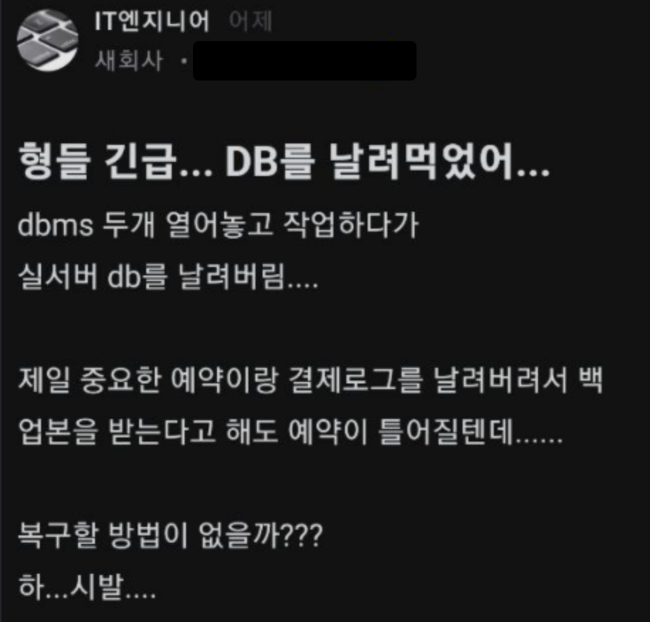
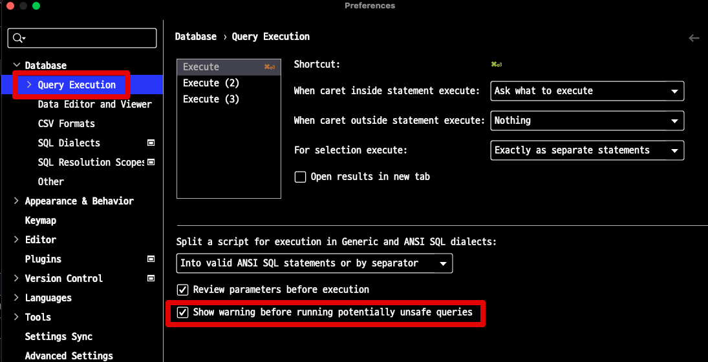
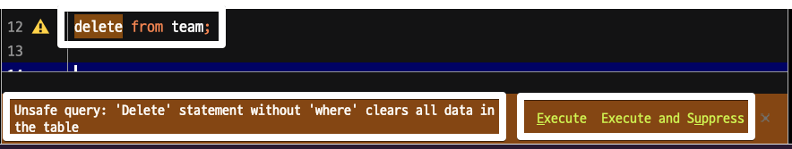
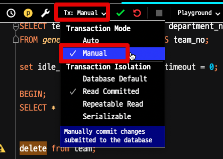
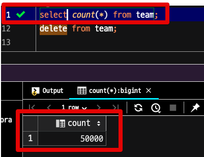
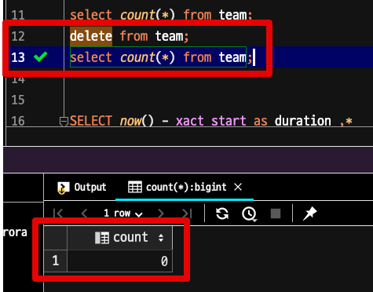
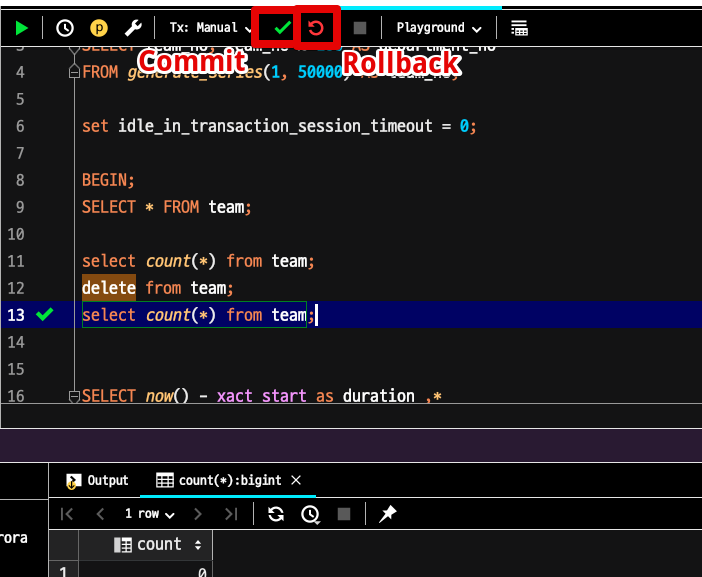
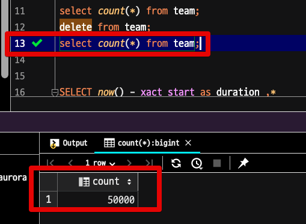

# DataGrip 에서 안전하게 Command 수행하기

DataGrip을 포함한 GUI 도구로 운영 DB에 쿼리를 수행하는건 항상 조심해야한다.  
하지만, 매번 모든 쿼리를 사람이 주의해서 수행하는건 불가능하며, 사람이라면 무조건 실수를 할 수 있다.

사람인 이상 잘못된 쿼리를 실행할 수 있지만, 이게 최대한 치명적인 실수가 발생하지 않도록 장치를 둘 순 있다.
그래서 가능한 실수를 할 수 없는 환경을 조성해서 진행하는게 필요하다.

## 1. Reader DB 활용

보통 클라우드 서비스를 사용하거나, 어느정도 정비가 되어있는 상황이라면 Reader DB (Replica DB) 가 존재한다. 

GUI 도구를 사용하다보면 의도치 않게 UI 상에서 데이터 수정을 일으킬 수 있다.  
그래서 단순 조회가 필요한 경우 조회 기능 밖에 지원하지 않는 DB (Reader)를 사용한다.  

## 2. Safe Execution

조건문 없이 Update, Delete 등이 수행할때 항상 경고와 확인 절차를 진행시킬 수 있다.

이는 조건문을 작성했어도 해당 조건문을 빼놓고 쿼리를 수행하는 등을 방지한다.

DataGrip에서는 `Preferences` → `Database` → `Query Execution` 으로 가서 `Show warning before running potentially unsafe queries` 를 체크한다.

> 체크가 안되어있으면 어떤 쿼리든 즉시 실행된다.

체크 되면 다음과 같이 조건 없는 수정 쿼리들에 대해선 항상 경고 메세지와 한번 더 체크후 실행하는 환경이 구성된다.

경고 메세지 우측에 있는 `Execute` 를 클릭해야만 실제 쿼리가 수행된다.  
이를 통해 **전체 삭제, 전체 수정에 대해서는 한번 더 체크**를 할 수 있다.  

## 3. Manual Transaction

운영 DB의 데이터를 수정/삭제 해야하는 경우도 있다.
항상 운영 DB에 Update, Delete, 스키마 변경등은 항상 조심, 또 조심해야 한다.  
  
이를 위해 쿼리 수행전에 **트랜잭션을 두면 쿼리 결과가 의도치 않은 경우 롤백을 해서** 원래대로 돌아갈수 있도록 할 수 있다.  
  
일반적으로 DB 도구들은 **트랜잭션이 Auto이다**.

그래서 쿼리 수행 즉시 트랜잭션이 반영되서 실제 DB에 반영된다.

하지만, 이를 **수동으로 반영** 할 수 있다.

DataGrip의 상단을 보면 `Tx` 로 된 Select Box가 있다.

이걸 `Auto` → `Manaul` 로 변경한다.

Auto 는 쿼리 수행 결과 즉시 반영이다.

**Manaul 로 하면 쿼리 수행후 commit을 해야만 반영**된다.

Manaul로 하고 테스트해보자.

#### 현재 테이블

여기서 `delete from team` 으로 전체 데이터를 날리고

다시 한번 테이블을 조회해본다.

**현재 테이블 조회 결과는 0건**이다.

이는 현재 쿼리 콘솔의 트랜잭션안에서 조회했기 때문이며,

실제 DB상에서는 delete가 수행되지 않은 상태이다.

select 결과를 보고 우측 상단의 `Commit` 버튼과 `Rollback` 버튼 중 원하는 것을 선택해서 실행한다.

- `Commit` 을 선택하면 실제 쿼리 결과가 DB에 반영 되는 것이고
- `Rollback` 을 선택하면 delete를 수행하기전 상태로 **롤백** 된다.

여기서는 `Rollback` 을 선택해서 다시 한번 select를 해보면?

원래 데이터로 다시 돌아간 것을 확인할 수 있다.

## 마무리

잘못된 쿼리를 돌리려면 결국 데이터베이스 로그, 백업본 등을 활용해서 복구해야만 한다.  
이것 자체가 굉장히 큰 공수가 들기 때문에 가능하다면 **실수하기 어려운 환경**을 구성해서 예방하는 것이 좋다.  
위의 설정들은 당장의 쿼리 수행에는 귀찮은 부분들이 있다.  
(한번 더 체크라던가, 수동으로 커밋 한다던가 등)  
  
하지만 사고가 터졌을때의 위험도를 생각한다면 충분히 적응하는 것이 더 좋다.